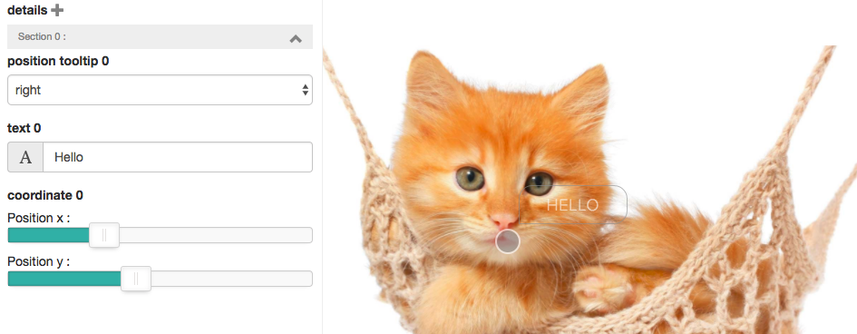

# abe-rangeslider

> plugin [AbeCMS](https://github.com/abecms/abecms/) for range slider UI component

This plugin integrate inside abecms backend a type range slider, for exemple to position element inside template (usefull for position absolute element like tooltip over image etc ...)




```shell
abe install wonknu/abe-rangeslider
```
## How to use

Add ```sliderrand='1'``` inside abe tag to convert a regular text input into rangeslider

```
{{#each points}}
	<div class="detail-hover" style="{{abe type='text' key='points.coordinate' desc='coordinate' tab='detailed image' sliderrand='1'}}">
	text tooltip
	</div>
{{/each}}	
```

## Example generated HTML

```html
<!-- point 1 -->
<div class="detail-hover" style="left:90%;top:10%">
	text tooltip
</div>
<!-- point 2 -->
<div class="detail-hover" style="left:31.64%;top:41.94%">
	text tooltip
</div>
<!-- point 3 -->
<div class="detail-hover" style="left:50%;top:70%">
	text tooltip
</div>
```
